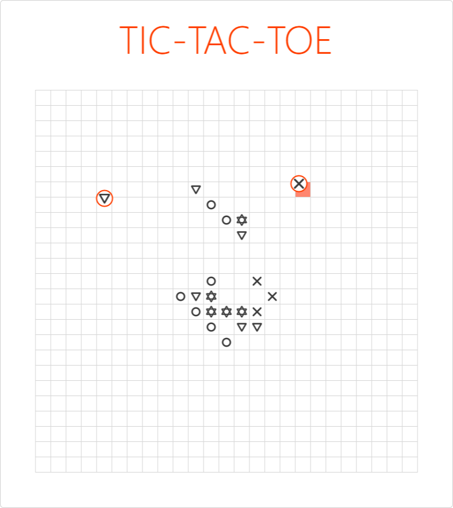

# Svelte Tic-Tac-Toe

Multiplayer tic-tac-toe on a 25*25 board with 4 pieces instead of just 2 and everyone plays at the same time. Chaos? Yes.


---

## Usage

Clone this repo, then install everything else using NPM:
```bash
cd backend
npm i
cd ..
cd frontend
npm i 
```

Start in dev mode with 
```bash
npm run dev
```
...or build with
```bash
npm run build
cd ..
cd backend
npm run start
```

## Notes
This project started as a simple test of Svelte, but I kept adding new things to it and it grew this. I have however loved working with Svelte and I'll definitely create new projects with it in the future. I can confidently say that Svelte is now my favourite framework.  

## Ideas for the future
* Add mobile support
* Optimize performance
* Make it at least a bit hack-proof

## License
[MIT](https://choosealicense.com/licenses/mit/)
